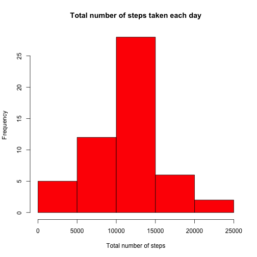
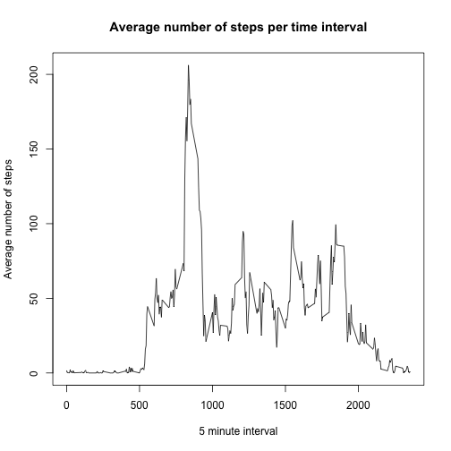
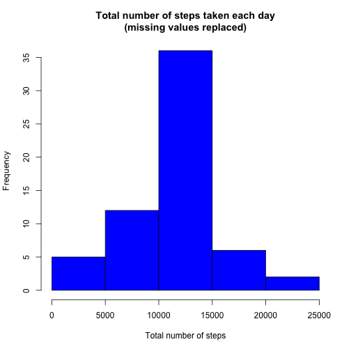
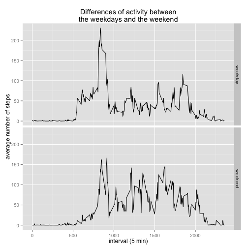

## Basic settings


```r
echo = TRUE
```

## Loading and preprocessing the data

Once the data is loaded, using 'read.csv' in combination with 'unz', the only transformation required is to assign the 'date' column the 'factor' type. 


```r
data <- read.csv(unz("activity.zip", "activity.csv"))

data$date <- as.factor(data$date)
```

## What is mean total number of steps taken per day?

### Calculate the total number of steps taken per day

A new data frame holding the totals per day is created and stored for ease of use. 


```r
library(dplyr)
```

```
## 
## Attaching package: 'dplyr'
## 
## The following objects are masked from 'package:stats':
## 
##     filter, lag
## 
## The following objects are masked from 'package:base':
## 
##     intersect, setdiff, setequal, union
```

```r
steps_per_day <- data %>% group_by(date) %>% summarise_each(funs(sum(steps)), -interval)
steps_per_day
```

```
## Source: local data frame [61 x 2]
## 
##          date steps
##        (fctr) (int)
## 1  2012-10-01    NA
## 2  2012-10-02   126
## 3  2012-10-03 11352
## 4  2012-10-04 12116
## 5  2012-10-05 13294
## 6  2012-10-06 15420
## 7  2012-10-07 11015
## 8  2012-10-08    NA
## 9  2012-10-09 12811
## 10 2012-10-10  9900
## ..        ...   ...
```

### Make a histogram of the total number of steps taken each day


```r
hist(steps_per_day$steps, col = "red", xlab = "Total number of steps", main = "Total number of steps taken each day")
```

 

### Calculate and report the mean and median of the total number of steps taken per day.

**Mean of the total number of steps taken per day:**

```r
mean(steps_per_day$steps, na.rm=T)
```

```
## [1] 10766.19
```
**Median of the total number of steps taken per day**

```r
median(steps_per_day$steps, na.rm=T)
```

```
## [1] 10765
```

## What is the average daily activity pattern?

### Make a time series plot (i.e. type = "l") of the 5-minute interval (x-axis) and the average number of steps taken, averaged across all days (y-axis)


```r
ave_steps_int <- data %>% group_by(interval) %>% summarise_each(funs(mean(steps, na.rm = T)), -date)

with(ave_steps_int, plot(steps ~ interval, type = "l", ylab = "Average number of steps", xlab = "5 minute interval", main = "Average number of steps per time interval"))
```

 

### Which 5-minute interval, on average across all the days in the dataset, contains the maximum number of steps?


```r
subset(ave_steps_int, steps == max(ave_steps_int$steps, na.rm=T))
```

```
## Source: local data frame [1 x 2]
## 
##   interval    steps
##      (int)    (dbl)
## 1      835 206.1698
```


## Imputing missing values

### Calculate and report the total number of missing values in the dataset (i.e. the total number of rows with NAs)


```r
sum(is.na(data$steps))
```

```
## [1] 2304
```

### Devise a strategy for filling in all of the missing values in the dataset.

The missing values will be filled with the average steps for the specific interval accross all days.

### Create a new dataset that is equal to the original dataset but with the missing data filled in.


```r
data_nonas <- merge(data, ave_steps_int, by="interval")

for (i in 1:nrow(data_nonas)) {
        if (is.na(data_nonas[i,]$steps.x)){
                data_nonas[i,]$steps.x <- data_nonas[i,]$steps.y
        }
}

data_nonas <- select(data_nonas, date, steps=steps.x, interval)
```

### Make a histogram of the total number of steps taken each day (missing values replaced).

As before, a new data frame holding the totals per day is created and stored for ease of use. 


```r
steps_per_day_nonas <- data_nonas %>% group_by(date) %>% summarise_each(funs(sum(steps)), -interval)
steps_per_day_nonas
```

```
## Source: local data frame [61 x 2]
## 
##          date    steps
##        (fctr)    (dbl)
## 1  2012-10-01 10766.19
## 2  2012-10-02   126.00
## 3  2012-10-03 11352.00
## 4  2012-10-04 12116.00
## 5  2012-10-05 13294.00
## 6  2012-10-06 15420.00
## 7  2012-10-07 11015.00
## 8  2012-10-08 10766.19
## 9  2012-10-09 12811.00
## 10 2012-10-10  9900.00
## ..        ...      ...
```


```r
hist(steps_per_day_nonas$steps, col = "blue", xlab = "Total number of steps", main = "Total number of steps taken each day\n(missing values replaced)")
```

 

### Calculate and report the mean and median total number of steps taken per day (missing values replaced).

**Mean of the total number of steps taken per day (missing values replaced):**

```r
mean(steps_per_day_nonas$steps, na.rm=T)
```

```
## [1] 10766.19
```
**Median of the total number of steps taken per day (missing values replaced):**

```r
median(steps_per_day_nonas$steps, na.rm=T)
```

```
## [1] 10766.19
```

#### Do these values differ from the estimates from the first part of the assignment?

Mean does not change, median now is equal to the mean, unlike before.

#### What is the impact of imputing missing data on the estimates of the total daily number of steps?

Using the chosen strategy, there are no changes to the average values, but the median values get biased towards the mean. 

## Are there differences in activity patterns between weekdays and weekends?

### Create a new factor variable in the dataset with two levels -- "weekday" and "weekend" indicating whether a given date is a weekday or weekend day.


```r
Sys.setlocale("LC_TIME", "C")    # This line is needed so my system (a Spanish computer) won't interfere and give the weekdays names in Spanish.
```

```
## [1] "C"
```

```r
data_nonas$date <- as.POSIXct(data_nonas$date, format = "%Y-%m-%d")

data_nonas$weekday <- weekdays(data_nonas$date, abbr = TRUE)

data_nonas$daytype <- "weekday"

for (i in 1:nrow(data_nonas)){
        if (data_nonas[i,]$weekday == "Sat" | data_nonas[i,]$weekday == "Sun"){
                data_nonas[i,]$daytype <- "weekend"
        }
}

data_nonas$daytype <- as.factor(data_nonas$daytype)
data_nonas <- select(data_nonas, date, steps, interval, daytype)
```

### Make a panel plot containing a time series plot (i.e. type = "l") of the 5-minute interval (x-axis) and the average number of steps taken, averaged across all weekday days or weekend days (y-axis).


```r
ave_steps_int_nonas <- data_nonas %>% group_by(interval, daytype) %>% summarise_each(funs(mean(steps, na.rm = T)), -date)

library(ggplot2)

ggplot(ave_steps_int_nonas, aes(interval, steps)) + 
        geom_line() + 
        facet_grid(daytype ~ .) +
        ggtitle("Differences of activity between\nthe weekdays and the weekend") +
        labs(x="interval (5 min)",y="average number of steps")
```

 
